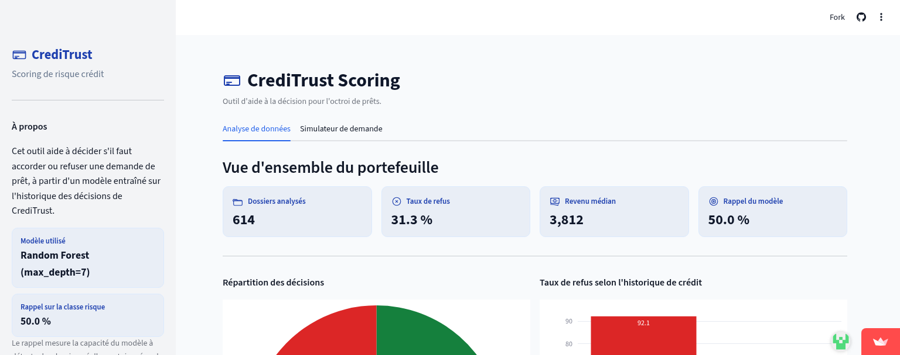
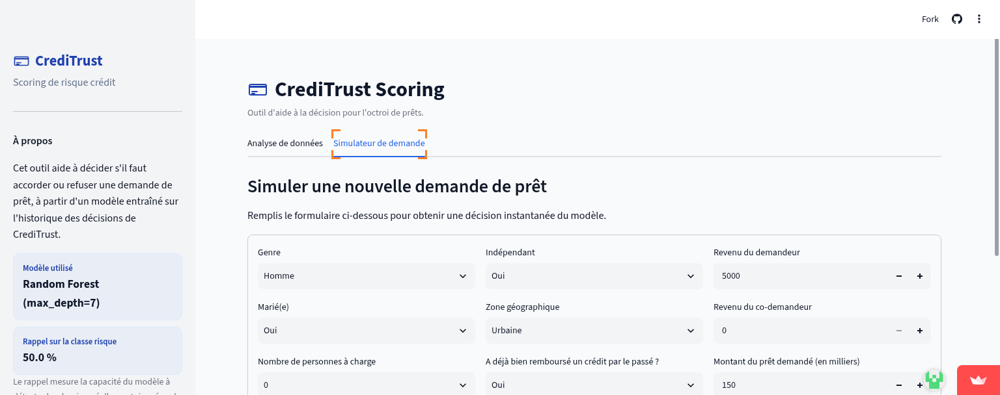
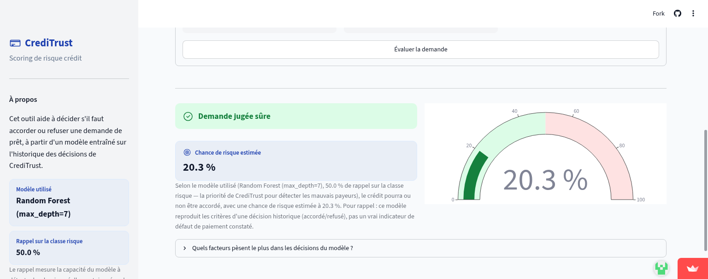

# Machine Learning — Mise en pratique

Dépôt de formation Data Analyst : exercices de Machine Learning et un projet
complet de bout en bout (analyse de données → modèle → dashboard).

## Contenu

| Dossier / fichier | Description |
|---|---|
| `notebooks/nb_01_...` | Introduction au ML : prétraitement de données. |
| `notebooks/nb_02_...` | Apprentissage supervisé : classification (5 modèles comparés sur Iris). |
| `notebooks/nb_03_...` | **Projet CrediTrust Scoring** : modélisation du risque de crédit. |
| `dashboard/` | Application Streamlit connectée au modèle du projet CrediTrust. |
| `data/` | Jeux de données utilisés dans les notebooks. |
| `EXPLICATIONS_PROJET.md` | Résumé simple du projet CrediTrust et des choix faits. |

## Le projet CrediTrust Scoring

Une banque fictive (CrediTrust Finance) veut un outil pour aider à décider
d'accorder ou refuser un prêt. À partir de `data/loan_data.csv` :

1. **Analyse exploratoire** : identifier les facteurs de risque (l'historique
   de crédit ressort comme le plus déterminant).
2. **Prétraitement** : nettoyage, gestion des valeurs manquantes,
   encodage — sans fuite de données entre train et test.
3. **Modélisation** : 5 modèles de classification comparés (Régression
   Logistique, Arbre de Décision, Random Forest, KNN, SVM), avec un réglage
   de la profondeur des arbres pour éviter le sur-apprentissage. Modèle
   retenu : **Random Forest**, priorisé sur le **rappel** (détecter un
   maximum de mauvais payeurs, quitte à refuser parfois un bon dossier).
4. **Dashboard Streamlit** : un formulaire pour tester une demande de prêt
   en direct, et des indicateurs sur le portefeuille de prêts.

Détails complets et justification des choix : voir
[`EXPLICATIONS_PROJET.md`](EXPLICATIONS_PROJET.md).

Dashboard en ligne : **https://creditrust.streamlit.app**

<p align="center">
  
</p>

<p align="center">
  
  
</p>

## Lancer le dashboard en local

```bash
cd dashboard
pip install -r requirements.txt
streamlit run app.py
```

## Outils utilisés

Python, pandas, scikit-learn, Streamlit, Plotly, Jupyter.
